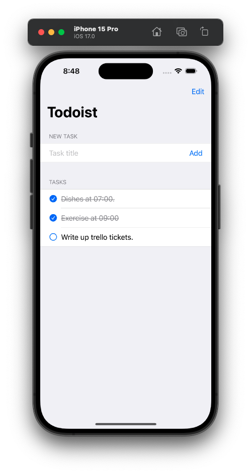

# Todoist (MVVM)

Todoist is a minimalist To-Do List app that combines motivation with focus to help you manage your tasks efficiently and stay inspired.

   

    
    
    
    
   

## Table of Contents
- [Installation](#installation)
- [Features](#features)
- [Architecture](#architecture)
- [Usage](#usage)
- [Contributing](#contributing)
- [License](#license)

## Installation

1. Clone this repository:

2. Open the project in Xcode.

3. Build and run the app on your iOS device or simulator.

## Features

- **Task Management**: Add and delete tasks.
- **Task Completion**: Mark tasks as completed.
- **Persistence**: Tasks are persisted using UserDefaults, so your data is saved between app launches.
- **Minimalist Design**: A minimalist and motivating user interface to keep you focused and inspired.

## Architecture

Todoist follows the MVVM (Model-View-ViewModel) architectural pattern:

- **Model**: The `Task` struct represents the data model for tasks and conforms to the `Codable` protocol for data serialization.

- **View**: The SwiftUI-based `TaskListView` is responsible for displaying tasks and user interaction.

- **ViewModel**: The `TaskListViewModel` class manages tasks and user interactions, and the `TaskRowViewModel` class represents individual tasks.

## Usage

1. **Adding Tasks**: Enter a task title in the "New Task" section and tap "Add."

3. **Completing Tasks**: Tap the checkbox next to a task to mark it as completed.

4. **Deleting Tasks**: Swipe left on a task in the list view and tap "Delete."

## Contributing

If you would like to contribute to this project or report issues, please open a new issue or a pull request. Your contributions are welcome!

## License

This project is licensed under the [MIT License](LICENSE).

---

**Todoist** is designed with ❤️.
